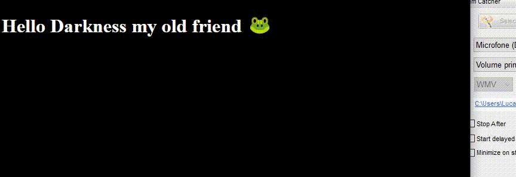

# CSS-Inteligent-DarkMode

## Article used as a base
[ Hello darkness, my old friend - Thomas Steiner](https://web.dev/prefers-color-scheme)

## Try on this Live Demo :D 

[DEMO 😈](https://lucaspdroz.github.io/CSS-Inteligent-DarkMode/)

## How to (Windows)

